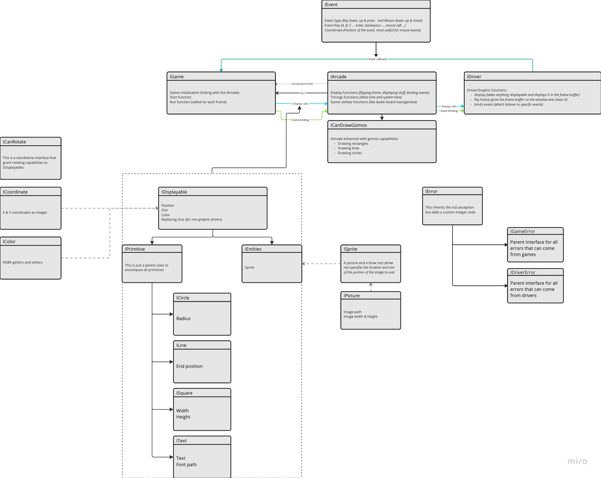

# Arcade

This is our repository for the epitech Arcade project.
We needed to create at least 3 graphic drivers (including sfml and ncurses):

- [Ncurses](./drivers/ncurses)
- [SFML](./drivers/sfml)
- [SDL2](./drivers/sdl2)

We also needed to create at least two game from a given list we chose:

- [Pac-Man](./games/pacman) This is a C implementation of the original Pac-Man game with all it's rules and original behaviours
- [Snake](./games/Snake)

## Documentation

We made two documentation to help you create game and graphic libraries

[Game documentation](./doc/HowToImplementNewGameLib.pdf)

[Driver documenation](./doc/HowToImplementNewGraphicsLib.pdf)

We also made UML diagrams for the shared library and our implementation of it:

Shared:

